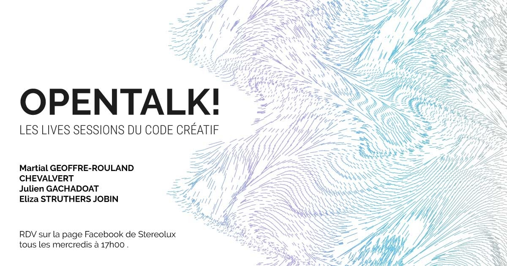

# OpenTalk!

 

## Random Creature Generator
Ce repo présente le projet Unity crée lors de l'évènement OpenTalk le 13 mai 2020. 

Version de Unity utilisé: 2019.3.0f3

Retrouvez chaque étape du projet dans __Assets__ / __Scenes__ / __Steps__
 
Retrouvez le code pour chaque étape dans __Assets__ / __Scripts__ / __Steps__

Visionez le workshop en replay <a href="https://www.stereolux.org/blog/opentalk-les-lives-sessions-du-code-creatif" target="_blank" rel="noopener noreferrer">ici</a>
 
Trouvez une transcription du workshop (EN) <a href="https://www.elizasj.com/unity_random_generator/" target="_blank" rel="noopener noreferrer">ici</a>
